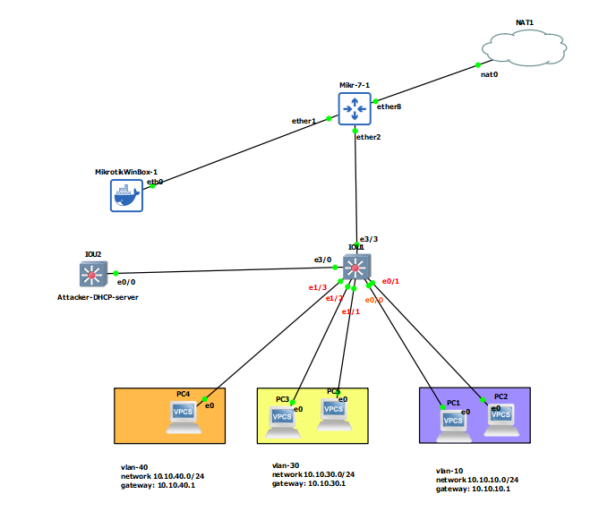

# Mikrotik configuration
```

# create Bridge interface

/interface bridge
add name=LAN
/interface bridge port
add bridge=LAN interface=ether2


# add interface vlan behind bridge port
/interface vlan
add interface=LAN name=vlan10 vlan-id=10
add interface=LAN name=vlan30 vlan-id=30
add interface=LAN name=vlan40 vlan-id=40


# set IP address to interface
/ip address
add address=10.10.10.1/24 interface=vlan10 network=10.10.10.0
add address=10.10.30.1/24 interface=vlan30 network=10.10.30.0
add address=10.10.40.1/24 interface=vlan40 network=10.10.40.


/ip dhcp-server
add address-pool=dhcp_pool0 interface=vlan10 name=dhcp1
add address-pool=dhcp_pool1 interface=vlan30 name=dhcp2
add address-pool=dhcp_pool2 interface=vlan40 name=dhcp3


/ip dhcp-server alert
add disabled=no interface=vlan10 on-alert=\
    "log/error message=\"another DHCP-SRV found\""


/ip dhcp-server network
add address=10.10.10.0/24 dns-server=8.8.8.8 gateway=10.10.10.1
add address=10.10.30.0/24 dns-server=8.8.8.8 gateway=10.10.30.1
add address=10.10.40.0/24 dns-server=8.8.8.8 gateway=10.10.40.1


# add rule for dns-hijack

/ip firewall nat
add action=redirect chain=dstnat dst-port=53 protocol=udp to-ports=53


# add nat for wan access

/ip firewall nat
add action=masquerade chain=srcna


```